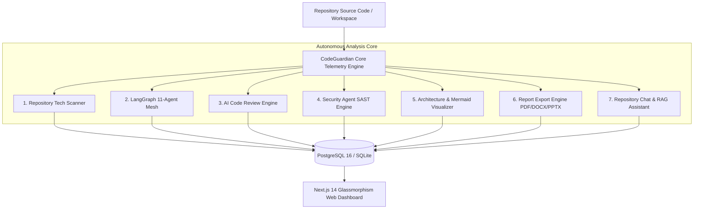

# 🛡️ CodeGuardian AI — Autonomous Enterprise Code Security & Audit Platform

> **AI-Driven Static Application Security Testing (SAST), Software Architecture Analysis, LangGraph Multi-Agent Orchestration, and Automated Code Review Engineering**

[](https://github.com/naveenkumar-balupala/CodeGuardian-AI/actions)
[](LICENSE)
[](https://python.org)
[](https://fastapi.tiangolo.com)
[](https://nextjs.org)
[](https://docker.com)

---

## 🌟 Overview

**CodeGuardian AI** is an enterprise-grade, multi-agent AI platform built for continuous code analysis, automated security vulnerability scanning (SAST), architectural linting, and automated code review engineering. 

It provides an end-to-end telemetry system combining deterministic static analysis tools (Semgrep, Bandit, SonarQube rules, ESLint) with LLM-powered multi-agent reasoning (LangGraph, OpenAI, Anthropic, Gemini).

---

## 🚀 Key Modules & Capabilities



### 1. 🔍 Automated Repository Scanner
Automatically detects repository technology stacks:
- **Languages**: Python, TypeScript, JavaScript, Go, Rust, Java, C++, SQL.
- **Frameworks**: FastAPI, Next.js, React, Node.js, Django, Flask, Express.
- **Infrastructure & CI/CD**: Docker, Docker Compose, Kubernetes, GitHub Actions, NGINX, Terraform.
- **Databases & ORMs**: PostgreSQL, SQLite, Redis, MongoDB, SQLAlchemy, Prisma.
- **API Specs**: OpenAPI, Swagger, GraphQL, gRPC.

### 2. 🤖 LangGraph Multi-Agent Orchestrator
Orchestrates 11 specialized autonomous agents with distinct prompts, toolkits, and memory:
1. **Coordinator Agent** (Master Workflow Dispatcher)
2. **Repository Agent** (Source Code Parsing & AST Mapping)
3. **Architecture Agent** (System Layout & Component Coupling)
4. **Security Agent** (SAST Rule Audit & CVSS Scoring)
5. **Database Agent** (Schema Integrity & Query Performance)
6. **Performance Agent** (Latency & N+1 Query Inspector)
7. **Testing Agent** (Test Coverage & Edge Case Auditor)
8. **Documentation Agent** (API Specs & README Verification)
9. **Recommendation Agent** (Prioritized Refactoring Roadmap)
10. **Report Agent** (Executive Summary Generation)
11. **Chat Agent** (Conversational RAG Exploration)

### 3. ⚡ AI Code Review Engine
- Multi-linter integration (Semgrep, SonarQube, Bandit, ESLint, Pylint).
- Metrics calculation: **Cyclomatic Complexity**, **Maintainability Index**, **Dead Code Ratio**, **Code Smells**.
- Generates **Composite Review Score (0-100)**, actionable AI explanations, and unified code patch diffs.

### 4. 🛡️ Security Agent Engine
- SAST rules for **SQL Injection**, **Secrets Leakage**, **XSS**, **JWT Flaws**, **CSRF**, and **Dependency CVEs**.
- **CVSS v3.1 Base Scoring** and **Composite Risk Score (0-100)** calculation.
- Maps findings to **OWASP Top 10 Taxonomy** (A01 - A10).

### 5. 🏗️ Architecture Analyzer & Visualizer Engine
- Generates valid **Mermaid Diagrams** (`graph TD`, `subgraphs`).
- Calculates **Module Coupling (Fan-In / Fan-Out)** and **Instability Index**.
- Audits **SOLID**, **DRY**, and **KISS** principle violations.

### 6. 📄 Professional Report Export Engine
- Exports formatted audit reports in **PDF**, **Word (DOCX)**, and **PowerPoint (PPTX)** formats.
- Supports Executive Summaries, charts datasets, AI explanations, and **Custom Enterprise Branding** (Company Logo, Brand Colors, Author).

### 7. 💬 Repository Chat & RAG Assistant
- Interactive code query assistant using RAG context retrieval.
- Exact source file citations (`file_path`, `line_start`, `line_end`).
- Quick intent shortcuts (`Explain Architecture`, `Explain File`, `Generate Docs`, `Suggest Improvements`, `Explain APIs`, `Find Bugs`).

---

## 🛠️ Technology Stack

- **Backend**: Python 3.11+, FastAPI, SQLAlchemy 2.0 (Async), Alembic, Pydantic v2, Pytest, Structlog, Uvicorn.
- **Frontend**: Next.js 14 (App Router), React 18, TypeScript, Tailwind CSS, Lucide React, Playwright E2E.
- **Database & Caching**: PostgreSQL 16, SQLite (Async Fallback), Redis 7.
- **DevOps & Infrastructure**: Docker, Docker Compose, NGINX Reverse Proxy, GitHub Actions CI/CD, Prometheus, Grafana.

---

## 💻 Local Quickstart (Standalone Mode)

### Prerequisites
- **Python 3.11+**
- **Node.js 20+**

### 1. Backend Setup
```bash
cd backend
python -m venv venv
# On Windows:
venv\Scripts\activate
# On Linux/macOS:
source venv/bin/activate

pip install -r requirements.txt
python -c "import asyncio; from app.main import auto_init_db; asyncio.run(auto_init_db())"
uvicorn app.main:app --reload --port 8000
```

### 2. Frontend Setup
```bash
cd frontend
npm install
npm run dev
```

### 🔑 Local Login Credentials
Open **[`http://localhost:3000/login`](http://localhost:3000/login)** in your browser:
- **Email**: `admin@codeguardian.ai`
- **Password**: `admin123`

---

## 🐳 Production Deployment (Docker Compose)

Launch the full containerized production stack (PostgreSQL, Redis, FastAPI, Next.js, NGINX, Prometheus, Grafana):

```bash
docker compose up --build -d
```

Access services:
- **Web UI & API Proxy**: `http://localhost` (Port 80 via NGINX)
- **FastAPI OpenAPI Specs**: `http://localhost:8000/docs`
- **Prometheus Metrics**: `http://localhost:9090`
- **Grafana Monitoring**: `http://localhost:3001`

---

## 🧪 Testing & Quality Assurance

### Run Backend Unit & Integration Tests (Pytest)
```bash
cd backend
pytest -v
```

### Run Frontend E2E Tests (Playwright)
```bash
cd frontend
npx playwright test
```

---

## 📜 License

Distributed under the **MIT License**. See [`LICENSE`](LICENSE) for details.
